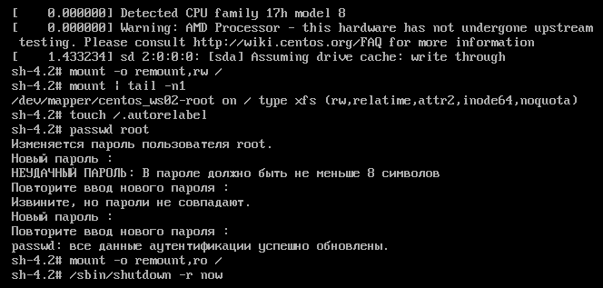
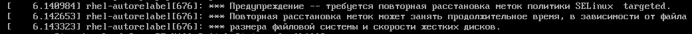
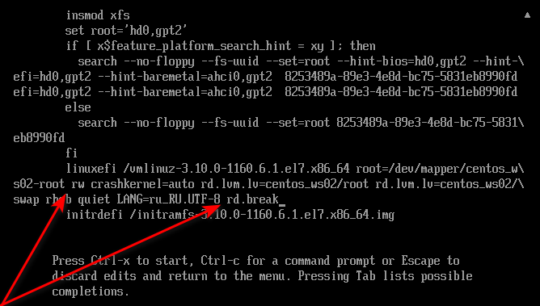
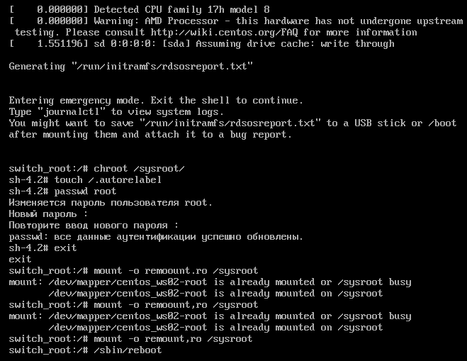
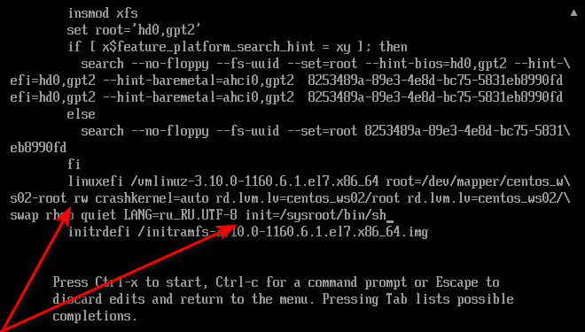
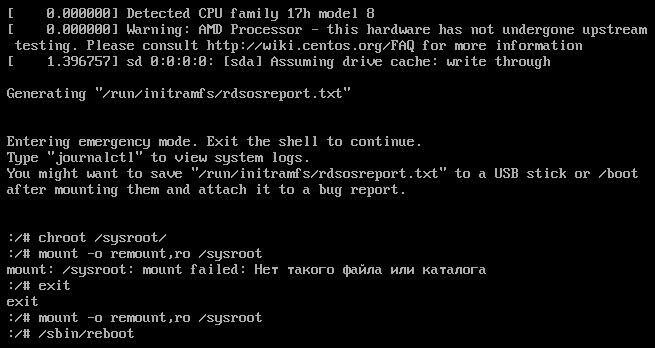

# otus-task006
## Работа с загрузчиком  
1. Попасть в систему без пароля несколькими способами
2. Установить систему с LVM, после чего переименовать VG
3. Добавить модуль в initrd

## Вход в систему без пароля.
1.     
Выбираю пункт меню загрузки, нажимаю клавишу "e" для входа в режим редактирования выбранного пункта. В строке linux16 для BIOS или в строке linuxefi в конец добавляю параметр <code>init=/bin/sh</code>  

------------------------------
выбираю пункт меню с нужным ядром  
  

------------------------------
редактирую пункт меню  
  

------------------------------
добавляю параметр загрузки (для BIOS)  
.png)  

------------------------------
добавляю параметр загрузки (для UEFI)  
.png)  

------------------------------
и нажимаю ctrl+x для выполнения отредактированного пункта загрузки.

инициализируется оболочка shell с примонтированным корнем в режиме чтения

------------------------------
Перемонтирую корневую ФС в режиме записи и сбрасываю пароль root-а.  
Создаю в корне файл /.autorelabel указывающий Selinux перемаркировать корневую фс с новым паролем root

уведомление Selinux, получившего указание на перемаркировку фс

------------------------------
2.  
В отличие от первого варианта, корневую фс монтирую сразу в rw добавив соотвествующий параметр и добавляю параметр rd.break.  

По факту загрузка осуществлена с примонтированным sysroot вместо /, для доступа к корню основной фс использую chroot.  

------------------------------
3. 
ситуация аналогичная 2 варианту, но инициализируется шел из sysroot.    

------------------------------  
  
## Переименовать VG

