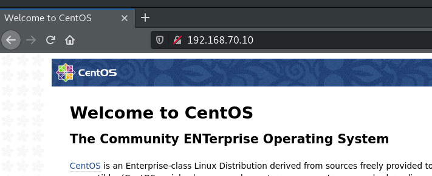
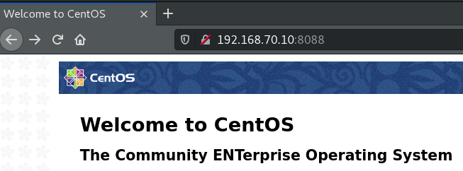

# Практика с SELinux
## Цель: Тренируем умение работать с SELinux: диагностировать проблемы и модифицировать политики SELinux для корректной работы приложений, если это требуется.
### Запустить nginx на нестандартном порту 3-мя разными способами:  
[1. - переключатели setsebool;](#switchset)   
[2. - добавление нестандартного порта в имеющийся тип;](#addport)  
[3. - формирование и установка модуля SELinux.](#createmod)  

### Введение.  
Сформирована виртуальная машина средствами Vagrant, с помощью provision shell-скрипта установлены пакеты:  
policycoreutils-python policycoreutils-devel policycoreutils-newrole policycoreutils-restorecond setools-console  
также установлен и активирован сервер nginx.  
#### Используемый инструментарий.    
Команды  
  
    semodule — управляет списком модулей  
    sestatus — текущий статус SELinux  
    setenforce 1/0 — включить/выключить enforcing  
    audit2allow — утилита для генерации правил ( и для подсказок )  
    sesearch — утилита для поиска правил в политике  
    seinfo — показывает информацию о типах, ролях, атрибутах итд  
    semanage — позволяет вносить изменения в политики  
    chcon — позволяет менять контекст на ФС  
    restorecon — востанавливает контекст по-умолчанию  
    setsebool — устанавливает переменную в on/off. С -P — пишет на диск  
    getsebool — получает переменную. -a — посмотреть все  
  
  
Изменения политики  
  
    semanage port -a/-d -t httpd_port_t -p tcp 8044 — добавить/удалить номер порта к контексту  
    semanage fcontext -a/-d -t httpd_cache_t "/srv/http/cache(/.*)?" — добавить/удалить контекст для этой маски  
    semanage permissive -a/-d httpd_t — включить/выключить режим permissive для httpd_t  
  
  
Аргументы к командам  
  
    id -Z — показывает контекст текущего пользователя  
    ls -Z — показывает контекст файлов  
    ps -Z — показывает контекст процессов  
    netstat -Z — показывает контекст соединений  
    usermod/useradd -Z связать пользователя с SELinux-пользователем  
    ausearch -m AVC — показывает нарушения политик  
  
### Ход выполнения задания.  

Проверяю статус сервиса nginx 
<details><summary><code>[root@selin ~]# systemctl status nginx.service </code></summary>

```shell
● nginx.service - The nginx HTTP and reverse proxy server
   Loaded: loaded (/usr/lib/systemd/system/nginx.service; enabled; vendor preset: disabled)
   Active: active (running) since Tue 2021-02-16 09:37:26 UTC; 4s ago
  Process: 25090 ExecStart=/usr/sbin/nginx (code=exited, status=0/SUCCESS)
  Process: 25087 ExecStartPre=/usr/sbin/nginx -t (code=exited, status=0/SUCCESS)
  Process: 25086 ExecStartPre=/usr/bin/rm -f /run/nginx.pid (code=exited, status=0/SUCCESS)
 Main PID: 25092 (nginx)
   CGroup: /system.slice/nginx.service
           ├─25092 nginx: master process /usr/sbin/nginx
           └─25093 nginx: worker process

Feb 16 09:37:26 selin systemd[1]: Starting The nginx HTTP and reverse proxy server...
Feb 16 09:37:26 selin nginx[25087]: nginx: the configuration file /etc/nginx/nginx.conf syntax is ok
Feb 16 09:37:26 selin nginx[25087]: nginx: configuration file /etc/nginx/nginx.conf test is successful
Feb 16 09:37:26 selin systemd[1]: Failed to parse PID from file /run/nginx.pid: Invalid argument
Feb 16 09:37:26 selin systemd[1]: Started The nginx HTTP and reverse proxy server.
    
```
</details> 

Всё - ок.  

_________________________________________________
Редактирую конфиг nginx, устанавливая на прослушивание нестандартный порт - 8088.
<summary><code>[root@selin ~]# sed -i 's/.*listen       80 default_server;.*/listen       8088 default_server;/' /etc/nginx/nginx.conf </code></summary>

_________________________________________________
Перезапускаю сервер nginx и наблюдаю ошибку запуска по причине.  
  
<code> nginx: [emerg] bind() to 0.0.0.0:8088 failed (13: Permission denied) <code>  
  
Запрета доступа к порту 8088.  
  	
<details><summary><code>[root@selin ~]# systemctl restart nginx </code></summary>

```shell
Job for nginx.service failed because the control process exited with error code. See "systemctl status nginx.service" and "journalctl -xe" for details.
  
```
</details> 


<details><summary><code>[root@selin ~]# systemctl status nginx.service </code></summary>

```shell
● nginx.service - The nginx HTTP and reverse proxy server
   Loaded: loaded (/usr/lib/systemd/system/nginx.service; enabled; vendor preset: disabled)
   Active: failed (Result: exit-code) since Tue 2021-02-16 09:45:06 UTC; 13s ago
  Process: 25090 ExecStart=/usr/sbin/nginx (code=exited, status=0/SUCCESS)
  Process: 25111 ExecStartPre=/usr/sbin/nginx -t (code=exited, status=1/FAILURE)
  Process: 25109 ExecStartPre=/usr/bin/rm -f /run/nginx.pid (code=exited, status=0/SUCCESS)
 Main PID: 25092 (code=exited, status=0/SUCCESS)

Feb 16 09:45:06 selin systemd[1]: Stopped The nginx HTTP and reverse proxy server.
Feb 16 09:45:06 selin systemd[1]: Starting The nginx HTTP and reverse proxy server...
Feb 16 09:45:06 selin nginx[25111]: nginx: the configuration file /etc/nginx/nginx.conf syntax is ok
Feb 16 09:45:06 selin nginx[25111]: nginx: [emerg] bind() to 0.0.0.0:8088 failed (13: Permission denied)
Feb 16 09:45:06 selin nginx[25111]: nginx: configuration file /etc/nginx/nginx.conf test failed
Feb 16 09:45:06 selin systemd[1]: nginx.service: control process exited, code=exited status=1
Feb 16 09:45:06 selin systemd[1]: Failed to start The nginx HTTP and reverse proxy server.
Feb 16 09:45:06 selin systemd[1]: Unit nginx.service entered failed state.
Feb 16 09:45:06 selin systemd[1]: nginx.service failed.
  
```
</details> 


_________________________________________________
#### 1. Предоставим возможность прослушивать nginx нестандартный порт с помощью переключателя setsebool. <a name="switchset"></a>  

https://www.nginx.com/blog/using-nginx-plus-with-selinux/  

Посмотрим нарушения политик
<details><summary><code>[root@selin ~]# ausearch -m AVC </code></summary>

```shell
----
time->Wed Feb 17 08:43:53 2021
type=PROCTITLE msg=audit(1613551433.976:845): proctitle=2F7573722F7362696E2F6E67696E78002D74
type=SYSCALL msg=audit(1613551433.976:845): arch=c000003e syscall=49 success=no exit=-13 a0=6 a1=55c1b7a3d288 a2=10 a3=7ffed87e1b80 items=0 ppid=1 pid=3017 auid=4294967295 uid=0 gid=0 euid=0 suid=0 fsuid=0 egid=0 sgid=0 fsgid=0 tty=(none) ses=4294967295 comm="nginx" exe="/usr/sbin/nginx" subj=system_u:system_r:httpd_t:s0 key=(null)
type=AVC msg=audit(1613551433.976:845): avc:  denied  { name_bind } for  pid=3017 comm="nginx" src=8088 scontext=system_u:system_r:httpd_t:s0 tcontext=system_u:object_r:unreserved_port_t:s0 tclass=tcp_socket permissive=0
  
```
</details> 

<details><summary><code>[root@selin ~]# cat /var/log/audit/audit.log | grep nginx | grep denied </code></summary>

```shell
type=AVC msg=audit(1613551433.976:845): avc:  denied  { name_bind } for  pid=3017 comm="nginx" src=8088 scontext=system_u:system_r:httpd_t:s0 tcontext=system_u:object_r:unreserved_port_t:s0 tclass=tcp_socket permissive=0
  
```
</details> 

_________________________________________________
С помощью утилиты audit2why ещё раз определяем критерии ошибки, также эта утилита предлогает вариант решения, которым я воспользуюсь
<details><summary><code>[root@selin ~]# grep 1613551433.976:845 /var/log/audit/audit.log | audit2why </code></summary>

```shell
type=AVC msg=audit(1613551433.976:845): avc:  denied  { name_bind } for  pid=3017 comm="nginx" src=8088 scontext=system_u:system_r:httpd_t:s0 tcontext=system_u:object_r:unreserved_port_t:s0 tclass=tcp_socket permissive=0

	Was caused by:
	The boolean nis_enabled was set incorrectly. 
	Description:
	Allow system to run with NIS

	Allow access by executing:
	# setsebool -P nis_enabled 1
  
```
</details> 


_________________________________________________
Параметр -P используется для применения политики на постоянной основе, без -P политика применяется до перезагрузки.
<details><summary><code>[root@selin ~]# man setsebool</code></summary>

```shell
Without the -P option, only the current boolean value is affected; the boot-time default settings are not changed.
If the -P option is given, all pending values are written to the policy file on disk. So they will be persistent across reboots.
  
```
</details> 


_________________________________________________
Применю политику до перезагрузки  

<code>[root@selin ~]# setsebool nis_enabled 1 </code>  

_________________________________________________
Перезапускаю nginx - всё ок.
<details><summary><code>[root@selin ~]# systemctl restart nginx</code></summary>

```shell
[root@selin ~]# systemctl status nginx.service
● nginx.service - The nginx HTTP and reverse proxy server
   Loaded: loaded (/usr/lib/systemd/system/nginx.service; enabled; vendor preset: disabled)
   Active: active (running) since Wed 2021-02-17 08:47:04 UTC; 15s ago
  Process: 3040 ExecStart=/usr/sbin/nginx (code=exited, status=0/SUCCESS)
  Process: 3038 ExecStartPre=/usr/sbin/nginx -t (code=exited, status=0/SUCCESS)
  Process: 3037 ExecStartPre=/usr/bin/rm -f /run/nginx.pid (code=exited, status=0/SUCCESS)
 Main PID: 3042 (nginx)
   CGroup: /system.slice/nginx.service
           ├─3042 nginx: master process /usr/sbin/nginx
           └─3043 nginx: worker process

Feb 17 08:47:03 selin systemd[1]: Starting The nginx HTTP and reverse proxy server...
Feb 17 08:47:04 selin nginx[3038]: nginx: the configuration file /etc/nginx/nginx.conf syntax is ok
Feb 17 08:47:04 selin nginx[3038]: nginx: configuration file /etc/nginx/nginx.conf test is successful
Feb 17 08:47:04 selin systemd[1]: Failed to parse PID from file /run/nginx.pid: Invalid argument
Feb 17 08:47:04 selin systemd[1]: Started The nginx HTTP and reverse proxy server.
  
```
</details> 


_________________________________________________
проверяю на каких портах слушает nginx - нестандартный порт открыт.
<details><summary><code>[root@selin ~]# ss -tulnp | grep nginx</code></summary>

```shell
tcp    LISTEN     0      128       *:8088                  *:*                   users:(("nginx",pid=3043,fd=6),("nginx",pid=3042,fd=6))
tcp    LISTEN     0      128    [::]:80                 [::]:*                   users:(("nginx",pid=3043,fd=7),("nginx",pid=3042,fd=7))
  
```
</details> 

Браузер соединяется с nginx по нестандартному порту



_________________________________________________
Перезагружаю виртуальную машину
<code>[root@selin ~]# reboot</code>  
Проверяю на каких портах слушает nginx - вывод пустой, сервис не запустился. 
<summary><code>[root@selin ~]# ss -tulnp | grep nginx</code></summary>  

_________________________________________________
#### 2. Добавление нестандартного порта в имеющийся тип.<a name="addport"></a> 
http://blog.102web.ru/howto/selinux-centos-komandy/  

Разрешаю доступ к порту.  
<code>[root@selin ~]# semanage port -a -t http_port_t -p tcp 8088</code>  

_________________________________________________
Проверяю разрешения на доступ к порту.   
<details><summary><code>[root@selin ~]# semanage port -l | grep http</code></summary>

```shell
http_cache_port_t              tcp      8080, 8118, 8123, 10001-10010
http_cache_port_t              udp      3130
http_port_t                    tcp      8088, 80, 81, 443, 488, 8008, 8009, 8443, 9000
pegasus_http_port_t            tcp      5988
pegasus_https_port_t           tcp      5989
  
```
</details> 

_________________________________________________
Рестартую nginx и проверяю статус сервера.
<details><summary><code>[root@selin ~]# systemctl restart nginx.service</code></summary>

```shell
[root@selin ~]# systemctl status nginx.service
● nginx.service - The nginx HTTP and reverse proxy server
   Loaded: loaded (/usr/lib/systemd/system/nginx.service; enabled; vendor preset: disabled)
   Active: active (running) since Wed 2021-02-17 08:50:30 UTC; 8s ago
  Process: 995 ExecStart=/usr/sbin/nginx (code=exited, status=0/SUCCESS)
  Process: 993 ExecStartPre=/usr/sbin/nginx -t (code=exited, status=0/SUCCESS)
  Process: 992 ExecStartPre=/usr/bin/rm -f /run/nginx.pid (code=exited, status=0/SUCCESS)
 Main PID: 997 (nginx)
   CGroup: /system.slice/nginx.service
           ├─997 nginx: master process /usr/sbin/nginx
           └─998 nginx: worker process

Feb 17 08:50:30 selin systemd[1]: Starting The nginx HTTP and reverse proxy server...
Feb 17 08:50:30 selin nginx[993]: nginx: the configuration file /etc/nginx/nginx.conf syntax is ok
Feb 17 08:50:30 selin nginx[993]: nginx: configuration file /etc/nginx/nginx.conf test is successful
Feb 17 08:50:30 selin systemd[1]: Failed to parse PID from file /run/nginx.pid: Invalid argument
Feb 17 08:50:30 selin systemd[1]: Started The nginx HTTP and reverse proxy server.
  
```
</details> 

_________________________________________________
Проверяю на каких портах слушает nginx - всё ок.
<details><summary><code>[root@selin ~]# ss -tulnp | grep nginx</code></summary>

```shell
tcp    LISTEN     0      128       *:8088                  *:*                   users:(("nginx",pid=998,fd=6),("nginx",pid=997,fd=6))
tcp    LISTEN     0      128    [::]:80                 [::]:*                   users:(("nginx",pid=998,fd=7),("nginx",pid=997,fd=7))

_________________________________________________
Удаляю порт из разрешённых.
<code>[root@selin ~]# semanage port -d -t http_port_t -p tcp 8088</code>

_________________________________________________
Рестартую nginx - т.к. порт закрыт, получаем ожидаемую ошибку.
<details><summary><code>[root@selin ~]# systemctl restart nginx.service</code></summary>

```shell
Job for nginx.service failed because the control process exited with error code. See "systemctl status nginx.service" and "journalctl -xe" for details.
  
```
</details> 

_________________________________________________
### 3. - формирование и установка модуля SELinux.<a name="createmod"></a>  
https://docs.fedoraproject.org/ru-RU/Fedora/13/html/Security-Enhanced_Linux/sect-Security-Enhanced_Linux-Fixing_Problems-Allowing_Access_audit2allow.html  

Определяем ошибку.
<details><summary><code>[root@selin ~]# tail /var/log/audit/audit.log | grep nginx | grep denied</code></summary>

```shell
type=AVC msg=audit(1613551927.961:74): avc:  denied  { name_bind } for  pid=1017 comm="nginx" src=8088 scontext=system_u:system_r:httpd_t:s0 tcontext=system_u:object_r:unreserved_port_t:s0 tclass=tcp_socket permissive=0
  
```
</details> 

_________________________________________________
Используя утилиту audit2allow создадим модуль политики.
<details><summary><code>[root@selin ~]# grep 1613551927.961:74 /var/log/audit/audit.log | audit2allow -M http_port --debug</code></summary>

```shell
******************** IMPORTANT ***********************
To make this policy package active, execute:

semodule -i http_port.pp
  
```
</details> 

И применим его.
<code>[root@selin ~]# semodule -i http_port.pp</code>

_________________________________________________
Рестартуем nginx и проверяем его статус.
<details><summary><code>[root@selin ~]# systemctl restart nginx.service</code></summary>

```shell
[root@selin ~]# systemctl status nginx.service
● nginx.service - The nginx HTTP and reverse proxy server
   Loaded: loaded (/usr/lib/systemd/system/nginx.service; enabled; vendor preset: disabled)
   Active: active (running) since Wed 2021-02-17 08:54:23 UTC; 6s ago
  Process: 1046 ExecStart=/usr/sbin/nginx (code=exited, status=0/SUCCESS)
  Process: 1044 ExecStartPre=/usr/sbin/nginx -t (code=exited, status=0/SUCCESS)
  Process: 1043 ExecStartPre=/usr/bin/rm -f /run/nginx.pid (code=exited, status=0/SUCCESS)
 Main PID: 1048 (nginx)
   CGroup: /system.slice/nginx.service
           ├─1048 nginx: master process /usr/sbin/nginx
           └─1049 nginx: worker process

Feb 17 08:54:23 selin systemd[1]: Starting The nginx HTTP and reverse proxy server...
Feb 17 08:54:23 selin nginx[1044]: nginx: the configuration file /etc/nginx/nginx.conf syntax is ok
Feb 17 08:54:23 selin nginx[1044]: nginx: configuration file /etc/nginx/nginx.conf test is successful
Feb 17 08:54:23 selin systemd[1]: Failed to parse PID from file /run/nginx.pid: Invalid argument
Feb 17 08:54:23 selin systemd[1]: Started The nginx HTTP and reverse proxy server.
  
```
</details> 

проверяем порты - всё ок.
<details><summary><code>[root@selin ~]# ss -tulnp | grep nginx</code></summary>

```shell
tcp    LISTEN     0      128       *:8088                  *:*                   users:(("nginx",pid=1049,fd=6),("nginx",pid=1048,fd=6))
tcp    LISTEN     0      128    [::]:80                 [::]:*                   users:(("nginx",pid=1049,fd=7),("nginx",pid=1048,fd=7))
[root@selin ~]# 
  
```
</details> 

Задание выполнено.
